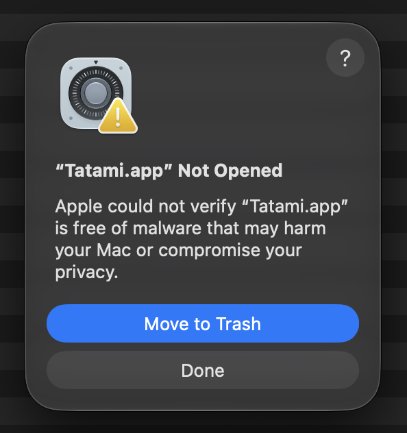

# Tatami

A free, open-source macOS menu bar app for arranging windows on a grid, like [Divvy](https://mizage.com/divvy/).

Tatami is named after Japanese tatami mats, which are laid out on a grid to form a room.

## Features

- **Grid panel.** Open the grid from the menu bar or with a shortcut. Drag across the cells, and the current window moves to the area you selected. The grid size can be set from 1 × 1 to 10 × 10.
- **Snap to screen edges.** Drag a window to the top of the screen to maximize it, or to the left or right edge to fill that half.
- **Custom global shortcuts.** Choose an area on a small grid, give it a name, and record a key combination. Pressing it moves the current window to that area.
- **Function shortcuts.** Show the grid, or move the current window to the next screen while keeping its relative position.
- **Multiple displays.** A grid panel appears on every screen, and the window moves to the screen you select on.
- **10 languages.** English, 繁體中文, 简体中文, Français, Deutsch, Español, हिन्दी, 日本語, 한국어, العربية. The language is chosen inside the app.
- Launch at login. The app lives only in the menu bar and has no Dock icon.

## Requirements

- macOS 14 Sonoma or later
- **Accessibility** permission, which Tatami needs to move other apps' windows

## Install

### Download

1. Download `Tatami-<version>.dmg` from [Releases](https://github.com/lenny-osp/tatami/releases).
2. Open the DMG and drag **Tatami** into **Applications**.

The DMG also includes **How to Open Tatami.txt**, which has the steps below in all 10 supported languages.

### Opening Tatami for the first time

Tatami is free and open source, but it is not notarized by Apple. The first time you open it, macOS blocks it with this message:



To allow it:

1. Click **Done**. Do not click **Move to Trash**.
2. Open **System Settings → Privacy & Security**.
3. Scroll down to **Security**. Next to the message saying Tatami was blocked, click **Open Anyway**, then enter your password.
4. Open Tatami again and click **Open Anyway**.

The **Open Anyway** button appears only for about an hour after macOS blocks the app. If you don't see it, open Tatami again to show the message again.

If you prefer Terminal, this one command replaces steps 1–4:

```bash
xattr -dr com.apple.quarantine /Applications/Tatami.app
```

You need to do this again after each update, because release builds are not signed with an Apple Developer ID.

### Build from source

You need the Xcode Command Line Tools. Install them with `xcode-select --install`. The full Xcode app is not needed.

```bash
git clone https://github.com/lenny-osp/tatami.git
cd tatami
./scripts/build-app.sh
open build/Tatami.app
```

To install it, copy `build/Tatami.app` to `/Applications`. To build a DMG, run `./scripts/make-dmg.sh` after building. An app you build yourself is not blocked by macOS.

## First launch

1. Tatami asks for **Accessibility** permission. Turn on Tatami in **System Settings → Privacy & Security → Accessibility**.
2. Snap overlaps with macOS's own window tiling. To avoid conflicts, turn off tiling by dragging windows to screen edges in **System Settings → Desktop & Dock**.
3. Open **Settings…** from the menu bar icon to choose your language, grid size, and shortcuts. **Help** in the same menu explains each feature.

## Troubleshooting

- **Windows don't move after rebuilding.** macOS ties Accessibility permission to the app's code signature, and an ad-hoc signed build gets a new signature every time it is rebuilt. Remove Tatami from the Accessibility list and add it again. Developers can create a self-signed code-signing certificate named `Tatami Dev` in Keychain Access, and the build script will then use it, keeping the permission across rebuilds.
- **A shortcut can't be recorded or does nothing.** Another tool, such as BetterTouchTool, Raycast, or Alfred, may already use the same key combination.

## Contributing

Issues and pull requests are welcome. Please read [AGENTS.md](AGENTS.md) for the project layout, conventions, and localization rules. Every user-visible string must be translated into all supported languages. Check the translations with `./scripts/check-localizations.sh`.

## License

[MIT](LICENSE) © 2026 Chihling Wang
